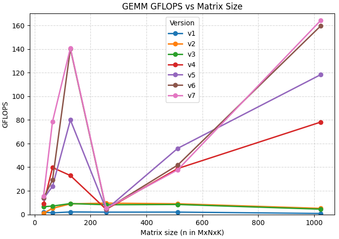

# Cache-Oblivious SGEMM

### Pre-requirement

```bash
# general preparation
python -m pip install -U pip setuptools wheel
python -m pip install -U pybind11 numpy
sudo apt install -y build-essential

# install package
python setup.py install

# run the test script
python main.py
```

### Performance

<div style="text-align:center; margin: 1rem 0;">
  
</div>

For more details, ref:

+ en: https://l1cache.io/blog/hpc/cache-oblivious-gemm/
+ zh-cn: https://zhuanlan.zhihu.com/p/1952496099660134297