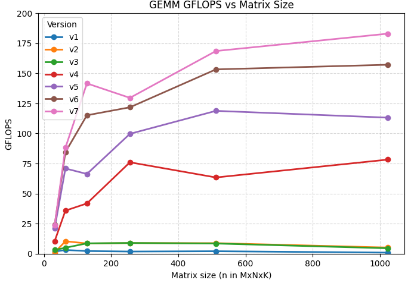

# Cache-Oblivious SGEMM

### Pre-requirement

```bash
# general preparation
python -m pip install -U pip setuptools wheel
python -m pip install -U pybind11 numpy
sudo apt install -y build-essential

# install package
python setup.py install
```

### Running the benchmark

Before running the benchmark, you need to configure openmp to make sure **each thread will be bind to each physical CPU core.**

All we need to do is to simply `export` some environment variables:

```bash
# env
export OMP_NUM_THREADS=<your physical CPU core>       # 8 recommended
export OMP_PLACES=cores                               # mapping to physical cores
export OMP_PROC_BIND=spread                           # spread to different places
export OMP_DYNAMIC=FALSE                              # disallow dynamic changing threads
```

Then running the benchmark:

```bash
python main.py
```

### Performance

<div style="text-align:center; margin: 1rem 0;">
  
</div>

For more details, ref:

+ en: https://l1cache.io/blog/hpc/cache-oblivious-gemm/
+ zh-cn: https://zhuanlan.zhihu.com/p/1952496099660134297